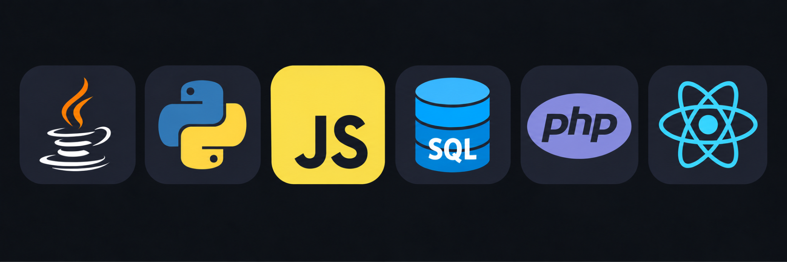
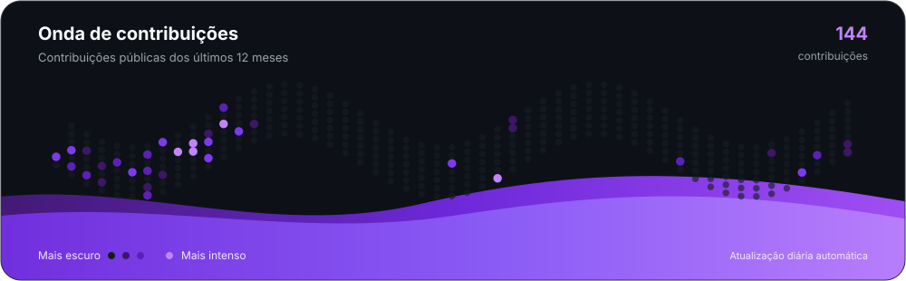

  

<h2 align="center">Bem-vindo ao meu GitHub</h2>

  Técnico em <strong>Desenvolvimento de Sistemas</strong> pela ETEC de Itaquera e estudante de
  <strong>Análise e Desenvolvimento de Sistemas</strong> na FATEC Zona Leste.
  Desenvolvo aplicações com foco em problemas reais, organização de código e evolução contínua.

  Atualmente aprofundo meus conhecimentos em <strong>Java</strong> e <strong>Python</strong>,
  enquanto ganho experiência prática com JavaScript, React, Node.js, APIs e bancos de dados.

  
  

---

<h3>
  
  Sobre mim
</h3>

- Cursando **Análise e Desenvolvimento de Sistemas** na FATEC Zona Leste.
- Técnico em **Desenvolvimento de Sistemas** pela ETEC de Itaquera.
- Em busca de uma oportunidade de **estágio em desenvolvimento de software**.
- Foco atual em **Java, Python e desenvolvimento web**.
- Experiência prática com **JavaScript, React, Node.js, Firebase, Supabase e APIs** em projetos acadêmicos e pessoais.
- Interesse em **arquitetura de software, microsserviços, CI/CD e computação em nuvem**.
- Inglês intermediário, com foco em evolução da conversação, e boa compreensão de espanhol.

<h3>
  
  Linguagens e tecnologias principais
</h3>

  

<h3>
  
  Projetos em destaque
</h3>

#### Açaí Bomba

Projeto real de cardápio digital desenvolvido para uma operação comercial, com montagem personalizada de produtos, carrinho e fluxo de checkout.

`React` `Vite` `JavaScript`

#### EventFlow

Plataforma web para criação e gerenciamento de eventos, com autenticação, controle de dados, geração de ingressos em PDF e QR Code.

`JavaScript` `Node.js` `Firebase` `Vercel`

#### PHD Escola Virtual

Plataforma educacional full-stack com autenticação, recuperação de senha, notificações e gerenciamento de dados acadêmicos.

`React` `Node.js` `Supabase`

---

<h3>
  
  Atividade no GitHub
</h3>

  

  Gerada a partir do calendário público de contribuições do GitHub e atualizada diariamente via GitHub Actions.

  <em>Aprendendo, construindo e evoluindo um projeto de cada vez.</em>

